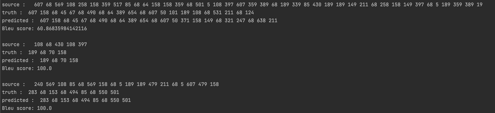

# 딥러닝 테스트

### 목차

**1. Experiment design**

​		1.1 실험 목표

​		1.2 데이터 분석(Train Data)

​		1.3 사용 모형

​		1. 4. 실험 전 예상결과

**2. Evaluation metrics**

​		2.1 Matrix

​		2.2 Graph

**3. Experimental results**

​		3.1 결과 정리

​		3.2 결과 사진

​		3.3 특이사항

# 1. Experiment design

### 1.1 실험 목표

​	Source sequence를 Target sequence와 matching 시키는 것.

### 1.2 데이터 분석(Train Data)

|        | Min_index | Max_index | Min_sen_len | Max_sen_len | Mean_sen_len | Vocab_size |       Duplicate_row       | Corpus_sen_count |
| :----: | :-------: | :-------: | :---------: | :---------: | :----------: | :--------: | :-----------------------: | :--------------: |
| Source |    21     |    619    |      2      |     81      |  18.985399   |     53     | 1192(전체의 문장의 16.4%) |       7260       |
| Target |     0     |    658    |      1      |     54      |  10.051928   |    595     | 1187(전체의 문장의 16.3%) |       7260       |

**데이터 분석 결과**

- target 데이터의 vocab size가 source 데이터의 vocab size보다 11.22배 큼

- source 데이터는 (적은 단어 수, 긴 문장길이)로 한 문장을 표현하고 target 데이터는 (많은 단어 수, 짧은 문장길이)로 한 문장을 표현함

- source, target vocab에서 동시에 가지고 있는 data가 하나 존재함

### 1.3 사용 모형

**Transformer 기반 모델 설계**

- 선정 이유

  Sequence-to-Sequence 과제를 수행하기 위한 모델로서 Machine Translation 분야에서 높은 성능을 보입니다.

  실험 목표인 sequence ordering 문제와 word matching 문제해결에 적합할 것으로 생각됩니다.

  

- 모델 configuation

  - batch_size = 128
  - n_layers = 4, 5, 6
  - d_model = 256, 512
  - ffn_hidden = 512, 1024, 2048
  - n_head = 8
  - drop_out = 0.1
  - eps = 1e-9
  - epoch = 300

  

- 특이사항

  - inference시, Greedy Decoder 사용
  - 기존 int형 Data를 String형으로 치환하고 새로운 index 할당
  - Train dataset을 8:2로 분리하여 Validation dataset 생성
  - Source data와 Target data의 겹치는 int형 data가 하나뿐입니다. 같은 inter data라도 문맥상 source와 target에서 다른 의미를 가질 것으로 추측됩니다.
    - source, target data 각각 단어 embedding matrix 생성
  - 약 7000개의 데이터를 기반으로 한 선행 연구를 찾지 못했습니다. 하이퍼 파라미터(n_layers, d_model, ffn_hidden)를 변경하며, 적은 데이터로도 mapping 가능한 모델을 실험할 것입니다.

### 1.4 실험 전 예상결과

 Transformer 기반 모델들은 대용량 Corpus를 기반으로 학습됩니다. 하지만 주어진 실험 가능한 데이터는 약 7000쌍입니다.

따라서 기존의 transformer 논문에서 제시된 BLEU 값인 25.8보다 낮은 결과가 예상됩니다.

# 2. Evaluation metrics

### 2.1 Matrix

| n_Layer | ffn_hidden | d_model | Bleu | Minimum Validation Loss | Minimum Training Loss |
| :-----: | :--------: | :-----: | :--: | :---------------------: | :-------------------: |
|    4    |    512     |   256   | 64.4 |  0.0019435733556747437  | 0.018460613270492657  |
|    4    |    512     |   512   | 65.0 |  0.0015508852547182787  | 0.008745959124770825  |
|    4    |    1024    |   256   | 64.7 |  0.0019230371796187353  |  0.01355955898559288  |
|    4    |    1024    |   512   | 65.3 |  0.0011342562925578518  | 0.008520502581908975  |
|    4    |    2048    |   256   | 65.5 |  0.0016919837375594811  |  0.01086221813507702  |
|    4    |    2048    |   512   | 65.5 |  0.001376342557539994   | 0.007276302775489571  |
|    5    |    512     |   256   | 64.2 |  0.002231116702949459   |  0.01886938899026617  |
|    5    |    512     |   512   | 63.1 |  0.001513567759750665   | 0.009881754547519528  |
|    5    |    1024    |   256   | 64.8 |  0.0013325254231776025  | 0.012938590244511548  |
|    5    |    1024    |   512   | 64.0 |  0.0014455648309773426  | 0.008352756070013604  |
|    5    |    2048    |   256   | 64.4 |  0.0016767567113592204  | 0.010531613137573004  |
|    5    |    2048    |   512   | 65.3 |  0.0017004185759684663  | 0.007896652829873821  |
|    6    |    512     |   256   | 62.5 |  0.0015653744869103486  |  0.01991665662954683  |
|    6    |    512     |   512   | 60.2 |  0.0017288613519419662  | 0.011663741578914873  |
|    6    |    1024    |   256   | 64.0 |  0.0017355654589747164  | 0.012594610442528907  |
|    6    |    1024    |   512   | 62.4 |  0.0016797263048250568  | 0.009949743626234324  |
|    6    |    2048    |   256   | 63.5 |  0.0020108426370742645  | 0.010368053558404032  |
|    6    |    2048    |   512   | 63.6 |  0.001762682026971809   | 0.007725261273267476  |

### 2.2 Graph
</img>
</img>
</img>
</img>
</img>
</img>
</img>
</img>
</img>
</img>
</img>
</img>
</img>
</img>
</img>
</img>
</img>
</img>

# 3. Experimental results

### 3.1 결과정리

실험한 모든 모델의 BLEU Score 값이 60 이상입니다. 실험 이전 예상했던 25.8 이하의 BLEU Score 보다 높은 결과를 얻었습니다. Machine Translation 분야의 논문들에서 실험한 데이터 쌍보다 데이터의 수가 부족했기 때문에 낮은 BLEU Score를 예상했었습니다. 하지만 데이터 쌍 대비 사용된 단어의 수가 적당했기 때문에 모델이 단어 Sequence의 규칙성을 잘 파악한 것 같습니다.

### 3.2 결과 사진

### 3.3 특이사항

**문제상황**

Loss Graph에서 train loss보다 validation loss가 더 낮게 관찰되었습니다. 

**문제 분석**

Train의 시작 부분에서 train set이 validation set보다 loss가 클 수 있습니다.(train loss는 학습 중 loss 평균, validation loss는 학습 후 loss 평균이므로) 하지만, 학습의 시작부터 끝까지 train set loss가 validation loss 보다 큰 것은 train data보다 validation data를 더 잘 예측한다는 의미이므로 상식적인 결과가 아닙니다.

**실험**

**데이터 세트 문제로 문제정의 후 실험**

- seed를 변경하여 Train set, validation set 재정의
- Test set으로 학습, train set으로 검증
- Vocab을 train set으로만 만들지 않고, 모든 데이터를 이용하여 vocab 생성(unk token을 정답으로 인식해서 loss 값에 영향을 주는지 실험)

**모델 문제로 문제정의 후 실험**

- 데이터 set을 multi30k로 변경하여 실험
- model에서 train mode에서 evaluation mode로 전환할 때, dropout이 적용 여부에 따른 결과 차이

**실험 결과**

- 데이터 세트 문제로 가설을 설정하고 실험한 모든 결과는 train set이 validation set보다 높은 loss를 가져왔습니다. 따라서 데이터 세트의 문제가 아니라고 생각됩니다.
- 데이터 셋을 Multi30k로 변경하고 실험을 진행했을 때, 정상적으로 train set이 validation set보다 낮은 결과를 보였습니다. 따라서 모델 구조의 문제가 아니라고 생각됩니다.
- model의 evaluation을 평가할 때 mode를 eval()로 전환하지 않고 실험한 결과 아래 결과 사진과 같이 train loss가 evaluation loss보다 컸던 문제가 해결되었습니다.

**결과 정리**

eval() mode에서는  dropout layer가 비활성화되기 때문에 더 많은 parameter로 결과값을 예측합니다. 따라서 train() mode보다 eval() mode에서 loss가 수렴하기 전까지 더 잘 예측하는 것을 확인할 수 있습니다.

**결과 사진**

- evaluation 평가시, eval() mode일 때와 eval() mode를 삭제했을 때 loss graph 
</img>
</img>

